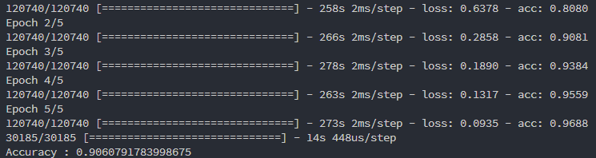

## Predicting origin of wine based on the description

Using a dense neural network with two hidden layers to predict the country of origin of a wine based on the description of the wine

Achieves 90%+ accuracy after training for only 5 epochs.

